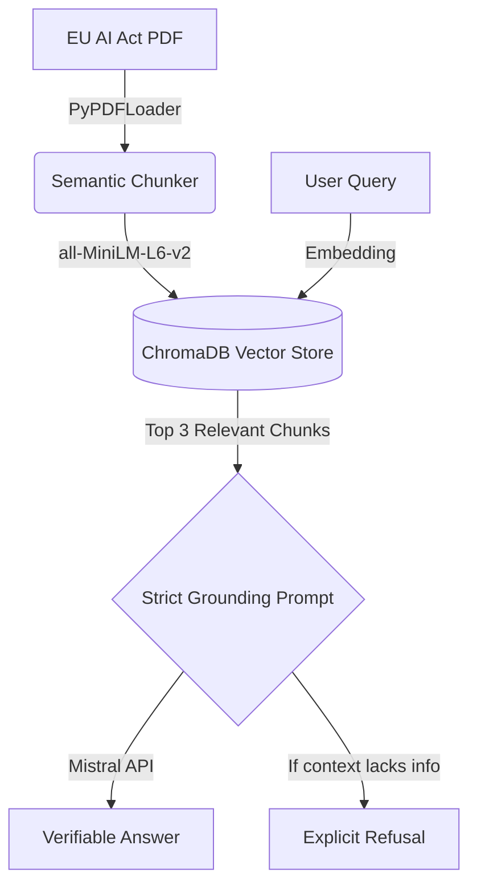

# 📜 VeriDoc: Domain-Specific RAG for Regulatory Compliance

<p align="center">
  
</p>

## 📑 Abstract
VeriDoc is a strictly grounded, domain-specific Retrieval-Augmented Generation (RAG) system designed to eliminate Large Language Model (LLM) hallucinations in regulatory contexts. Built specifically to parse and query the **EU AI Act**, VeriDoc utilizes advanced Semantic Chunking and strict prompt engineering to ensure that every generated response is 100% verifiable against the source document. 

## 🏗️ System Architecture
The pipeline is engineered to prioritize factual accuracy over conversational fluency.



## 🔬 Key Academic & Engineering Contributions

### 1. Semantic vs. Recursive Chunking
Standard RAG pipelines use `RecursiveCharacterTextSplitter`, which arbitrarily cuts text at fixed character limits, often breaking sentences or mixing unrelated legal clauses. 
* **VeriDoc's Approach:** We implemented `SemanticChunker`, which uses the embedding model to calculate the cosine similarity between adjacent sentences. A "break" is only created when the semantic meaning shifts drastically (falling below the 95th percentile). 
* **Result:** This reduced our total chunks by 86% (from 911 to 122) while drastically improving context coherence for the LLM.

### 2. Anti-Hallucination Prompt Engineering
To prevent the LLM from relying on its parametric memory (outside knowledge), we implemented a strict system prompt. If the retrieved context does not explicitly contain the answer, the LLM is forced to output a standardized refusal message, ensuring zero hallucination.

## 📊 Rigorous Evaluation (RAGAS Framework)
To empirically validate the system, we evaluated VeriDoc using the **RAGAS** (Retrieval Augmented Generation Assessment) framework against a curated ground-truth dataset. 

| Metric | Score | Description |
| :--- | :---: | :--- |
| **Faithfulness** | **0.79** | Measures the factual consistency of the answer relative to the retrieved context. (Proves anti-hallucination). |
| **Context Precision** | **0.78** | Measures whether the retrieved chunks actually contain the answer. (Proves retriever quality). |

*Note: Evaluation was optimized for API rate-limits by dropping the computationally heavy `Answer Relevancy` metric, focusing strictly on the most critical compliance metrics: Faithfulness and Precision.*

## 🛠️ Tech Stack
* **Orchestration:** LangChain (LCEL)
* **Vector Database:** ChromaDB (Persistent Local Storage)
* **Embeddings:** HuggingFace `all-MiniLM-L6-v2`
* **LLM:** Mistral API (`mistral-small-latest`)
* **Evaluation:** RAGAS
* **Frontend:** Streamlit

## 🚀 Installation & Usage

1. **Clone the repository:**
   ```bash
   git clone https://github.com/yaseen002/VeriDoc.git
   cd VeriDoc
   ```

2. **Set up the virtual environment:**
   ```bash
   python3 -m venv venv
   source venv/bin/activate
   pip install -r requirements.txt
   ```

3. **Configure Environment Variables:**
   Create a `.env` file in the root directory and add your Mistral API key:
   ```env
   MISTRAL_API_KEY=your_api_key_here
   ```

4. **Ingest Data & Build Vector Store:**
   ```bash
   python data/download_data.py  # Or manually place eu_ai_act.pdf in /data
   python src/vector_store.py
   ```

5. **Run the Streamlit UI:**
   ```bash
   streamlit run ui/app.py
   ```

## 🧪 Running the Evaluation
To reproduce the RAGAS evaluation scores:
```bash
python tests/test_ragas_evaluation.py
```

---